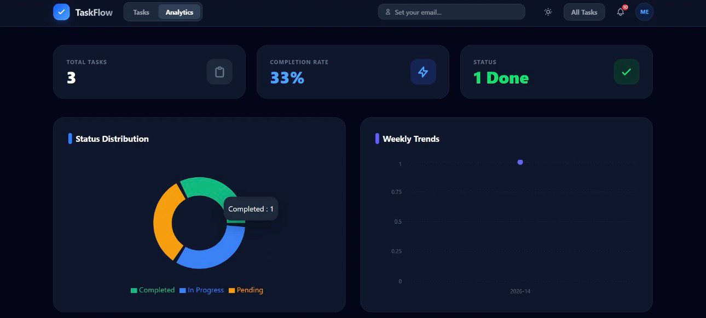

# TaskFlow: Real-Time Task Management System

TaskFlow is a modern, real-time task and project management application. It features a responsive Next.js frontend with dynamic theme support and a robust Express/MongoDB backend, perfectly decoupled to support modern split-deployments on Vercel.

---

## 🚀 Key Features

* **Real-time Synchronization:** Built with Pusher, task statuses and notifications update instantly across all connected clients.
* **Modern UI/UX:** A Pinterest-style task grid built with Tailwind CSS, supporting both Dark and Light modes.
* **Task Collaboration:** Share tasks with teammates via email and receive instant notifications when shared tasks are modified.
* **Live Analytics Dashboard:** Visualize your productivity with dynamic charts and progress metrics.
* **Serverless Ready:** The backend and frontend are optimized for independent, zero-configuration Vercel deployments.




---

## 🛠 Tech Stack

**Frontend:**
- Next.js 16 (React)
- Tailwind CSS (Styling)
- Axios (Data fetching)
- Pusher-JS (Real-time WebSockets)

**Backend:**
- Node.js & Express
- MongoDB & Mongoose
- Pusher (Event broadcasting)
- CORS (Dynamically secured for Vercel environments)

---

## 💻 Local Setup & Installation

### Prerequisites
- Node.js (v18+)
- MongoDB (Local instance or MongoDB Atlas)
- Pusher Account (for real-time keys)

### 1. Clone the repository
```bash
git clone https://github.com/mehrquest/task-manager.git
cd task-manager
```

### 2. Backend Setup
Navigate to the backend directory, install dependencies, and create an environment file.

```bash
cd backend
npm install
```

Create a `.env` file in the `backend/` directory:
```env
PORT=8000
MONGO_URI=mongodb+srv://<your_user>:<your_password>@cluster.mongodb.net/test
CLIENT_URL=http://localhost:3000

# Pusher Credentials
PUSHER_APP_ID=your_app_id
PUSHER_KEY=your_key
PUSHER_SECRET=your_secret
PUSHER_CLUSTER=your_cluster
```

Start the local backend server (defaults to port 8000):
```bash
npm run dev
```

### 3. Frontend Setup
Open a new terminal, navigate to the frontend directory, install dependencies, and configure your keys.

```bash
cd frontend
npm install
```

Create a `.env` (or `.env.local`) file in the `frontend/` directory:
```env
NEXT_PUBLIC_API_URL=http://localhost:8000/api
NEXT_PUBLIC_PUSHER_KEY=your_key
NEXT_PUBLIC_PUSHER_CLUSTER=your_cluster
```

Start the Next.js development server:
```bash
npm run dev
```
Visit `http://localhost:3000` to view the application!

---

## ☁️ Deployment (Vercel)

This repository is optimized for **Split Deployments**. You must create two separate Vercel projects from this single repository.

### 1. Deploy the Backend
- Create a new project in Vercel.
- Select this repository and set the **Root Directory** to `backend`.
- Ensure the **Framework** is set to `Other` or `Node.js`.
- Add all backend `.env` variables. *Set `CLIENT_URL` to your Vercel Frontend URL (`https://task-manager-frontend-tau-sooty.vercel.app`).*
- Deploy. (The included `backend/vercel.json` will automatically configure the Express serverless function).

### 2. Deploy the Frontend
- Create a second project in Vercel.
- Select this repository and set the **Root Directory** to `frontend`.
- Vercel will automatically detect `Next.js`. Ensure the output directory is `.next`.
- Add frontend `.env` variables. *Set `NEXT_PUBLIC_API_URL` to your Vercel Backend URL (`https://task-manager-backend-five-xi.vercel.app`).*
- Deploy.

---

## 📖 API Documentation

The backend exposes a secure REST API under the `/api` route.

### Tasks

| Method | Endpoint | Description |
|--------|----------|-------------|
| `GET` | `/api/tasks` | Fetches all tasks in the database. |
| `POST` | `/api/tasks` | Creates a new task. Requires `title` in body. |
| `PUT` | `/api/tasks/:id` | Updates task details (e.g., status changes). Triggers Pusher event. |
| `DELETE`| `/api/tasks/:id` | Deletes a task by ID. |
| `PUT` | `/api/tasks/:id/share` | Shares a task. Requires `{ "email": "user@email.com" }`. Triggers push notification. |
| `GET` | `/api/tasks/shared` | Fetches tasks shared with a specific user. Query parameter `?email=...` |

### Notifications

| Method | Endpoint | Description |
|--------|----------|-------------|
| `GET` | `/api/notifications` | Fetches the 10 most recent global notifications. |
| `PATCH`| `/api/notifications/:id/read` | Marks a specific notification as 'read'. |

### Analytics

| Method | Endpoint | Description |
|--------|----------|-------------|
| `GET` | `/api/analytics/overview` | Retrieves aggregated task counts (Pending, In Progress, Completed). |
| `GET` | `/api/analytics/trends` | Retrieves weekly historical completion trends for chart generation. |
